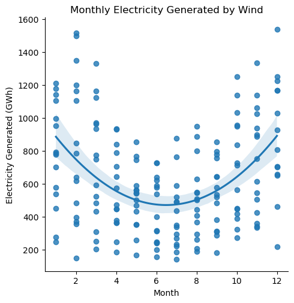
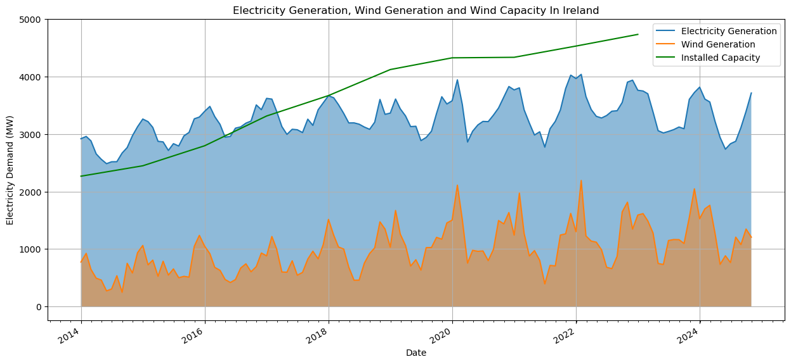

# Programming for Data Analytics Project
# Analysis of Wind Speed and Wind Energy in Ireland

---

## Overview

This project uses Python and various libraries to analyse wind speed and wind energy in Ireland and aims to identify possible trends in hourly and monthly wind speed data, explore the relationship between energy demand and wind energy generation, and predict future wind speed.
* **Data Visualisation:** Plot wind speed and energy data using [``matplotlib``](https://matplotlib.org/stable/) and [``seaborn``](https://seaborn.pydata.org/#).
* **Trend Analysis:** Identify seasonal trends in the data.
* **Prediction:** Use [``scikit-learn``](https://scikit-learn.org/stable/)'s decision tree regression to forecast future wind speeds.

---

## Getting Started

To run the [`project.ipynb`](./project.ipynb) Jupyter notebook, follow these steps:

### Install Jupyter Notebook:

You can install Jupyter Notebook using `pip` from the command line if it's not already installed:

```bash
pip install notebook
```

### Clone the Repository:

Clone the repository to your local machine:

```bash
git clone https://github.com/eoghanpw/PFDA-project
cd PFDA-project
```

### Install Dependencies:

Install the dependencies from the [`requirements.txt`](./requirements.txt) file:

```bash
pip install -r requirements.txt
```

### Start Jupyter Notebook:

Launch Jupyter Notebook from the command line:

```bash
jupyter notebook
```

### Open the Notebook:

Once Jupyter Notebook is running, it will open a new tab in your web browser. Navigate to the directory that contains [`project.ipynb`](./project.ipynb) and click to open it.

### Run the Cells:

You can run the cells by clicking on them and pressing Ctrl + Enter or alternatively, you can use the "Run" button in the toolbar.

---

## Usage Example

The code snippets below are extracted from the [`project.ipynb`](./project.ipynb) notebook and showcase some of the visualisation generated using `seaborn` and `matplotlib`.

```python
# Let's check if any correlation between the month and the electricity generated.

# Correlation between electricity generated and month.
corr_elec_gen = seai_df['month'].corr(seai_df['Generated'])
print(f'Correlation: {corr_elec_gen}')

# Plot the monthly wind speed and add a regression line.
title = 'Monthly Electricity Generated by Wind'
xlabel = 'Month'
ylabel = 'Electricity Generated (GWh)'

# Seanborn lmplot with 2nd order regression line.
sns.lmplot(data=seai_df, x='month', y='Generated', order=2
           ).set(title=title, xlabel=xlabel, ylabel=ylabel)

plt.show()
```


```python
# Plot.
fig, ax = plt.subplots(figsize=(15, 7))

# Plot eirgrid data.
a = monthly_eirgrid_df['IE Generation']
b = monthly_eirgrid_df['IE Wind Generation']

# Fill between plots.
date = monthly_eirgrid_df.index
ax.fill_between(date, 0, a, alpha=0.5)
ax.fill_between(date, 0, b, alpha=0.5)

# Add outline to fill between plot.
ax.plot(a, label='Electricity Generation')
ax.plot(b, label='Wind Generation')

# Plot installed wind capacity.
x = wind_capacity[wind_capacity.index > '2013-12-31']
ax.plot(x, label='Installed Capacity', color='green')

locator = mdates.AutoDateLocator()
formatter = mdates.ConciseDateFormatter(locator)
ax.xaxis.set_major_formatter(formatter)
ax.xaxis.set_minor_locator(AutoMinorLocator(12))
fig.autofmt_xdate()

yticks = np.arange(0, 6000, 1000)
ax.set_yticks(yticks)

ax.set_ylabel('Electricity Demand (MW)')
ax.set_xlabel('Date')

ax.grid(True)

ax.set_title('Electricity Generation, Wind Generation and Wind Capacity In Ireland')
ax.legend()

plt.show()
```


---

## Acknowledgements

- [pandas documentation](https://pandas.pydata.org/docs/)
- [matplotlib documentation](https://matplotlib.org/stable/index.html)
- [numpy documentation](https://numpy.org/doc/stable/)
- [seaborn](https://seaborn.pydata.org/tutorial.html)
- [Python for Data Analysis](https://wesmckinney.com/book/)
- [w3schools](https://www.w3schools.com/python/)
- [Real Python](https://realpython.com/)
- [ChatGPT](https://chatgpt.com/)
- [Met Eireann](https://www.met.ie/climate/available-data)
- [Wind Europe](https://windeurope.org/about-wind/wind-basics/)
- [EirGrid](https://www.eirgrid.ie/grid/system-and-renewable-data-reports)
- [SEAI](https://www.seai.ie/data-and-insights)

---

## Author
Eoghan Walsh